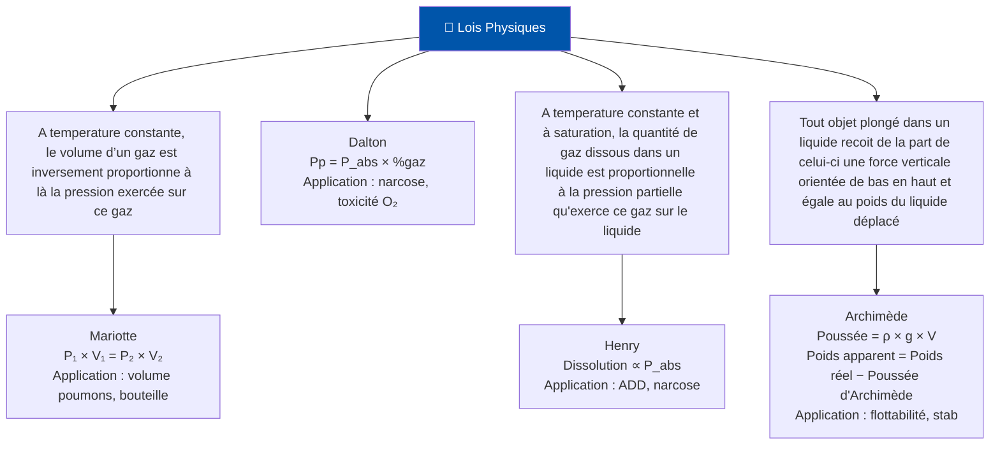
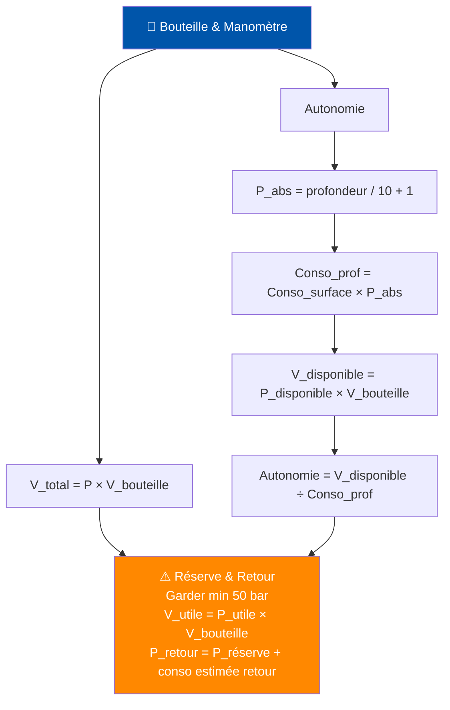
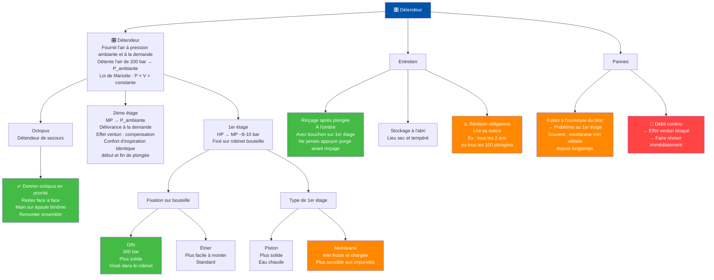
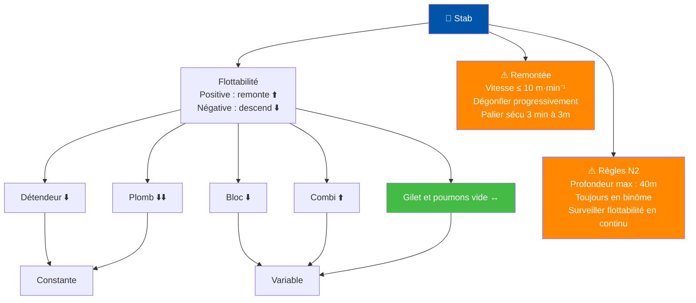
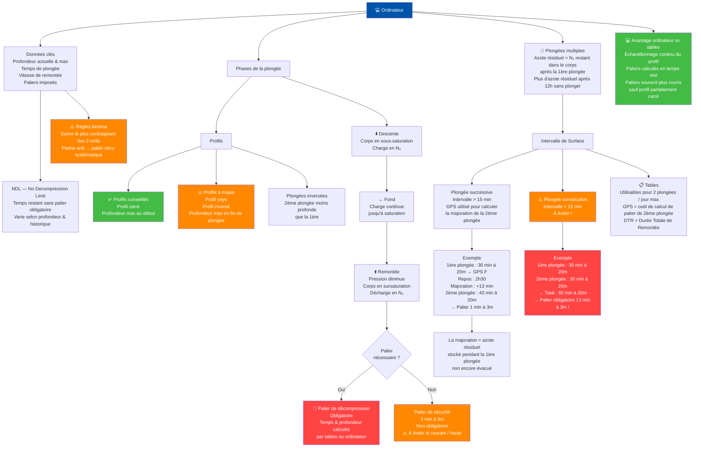

# 🧰 Matériel & Autonomie — N2 FFESSM

---

## 🧪 Lois Physiques

```mermaid
flowchart TD
    ROOT["🧪 Lois Physiques"]
    ROOT --> Mario["A temperature constante, le volume d’un gaz est inversement proportionne à là la pression exercée sur ce gaz"]
    Mario --> MARIO_1["Mariotte<br>P₁ × V₁ = P₂ × V₂<br>Application : volume poumons, bouteille"]
    ROOT --> DALTON["Dalton<br>Pp = P_abs × %gaz<br>Application : narcose, toxicité O₂"]
    ROOT --> HENRY["A temperature constante et à saturation, la quantité de gaz dissous dans un liquide est proportionnelle à la pression partielle qu'exerce ce gaz sur le liquide"]
    HENRY --> HENRY_1["Henry<br>Dissolution ∝ P_abs<br>Application : ADD, narcose"]
    ROOT --> ARCHI["Tout objet plongé dans un liquide recoit de la part de celui-ci une force verticale orientée de bas en haut et égale au poids du liquide déplacé"]
    ARCHI --> ARCHI_1["Archimède<br>Poussée = ρ × g × V<br>Poids apparent = Poids réel − Poussée d'Archimède<br>Application : flottabilité, stab"]

    style ROOT fill:#0055aa,color:#fff
```

---

## 🫧 Bouteille & Manomètre

```mermaid
flowchart TD
    ROOT["🫧 Bouteille & Manomètre"]
    ROOT --> BVOL["V_total = P × V_bouteille"]
    ROOT --> BAUT["Autonomie"]
    BAUT --> BAUT1["P_abs = profondeur / 10 + 1"]
    BAUT1 --> BAUT2["Conso_prof = Conso_surface × P_abs"]
    BAUT2 --> BAUT3["V_disponible = P_disponible × V_bouteille"]
    BAUT3 --> BAUT4["Autonomie = V_disponible ÷ Conso_prof"]
    BVOL --> BRES["⚠️ Réserve & Retour<br>Garder min 50 bar<br>V_utile = P_utile × V_bouteille<br>P_retour = P_réserve + conso estimée retour"]
    BAUT4 --> BRES

    style ROOT fill:#0055aa,color:#fff
    style BRES fill:#ff8800,color:#fff
```

---

## 🎛️ Détendeur

```mermaid
flowchart TD
    ROOT["🎛️ Détendeur"]
    ROOT --> DET0["🎛️ Détendeur<br>Fournit l'air à pression ambiante et à la demande<br>Détente l'air de 200 bar → P_ambiante<br>Loi de Mariotte : P × V = constante"]

    DET0 --> DET1["1er étage<br>HP → MP ~8-10 bar<br>Fixé sur robinet bouteille"]
    DET0 --> DET2["2ème étage<br>MP → P_ambiante<br>Délivrance à la demande<br>Effet venturi : compensation<br>Confort d'inspiration identique<br>début et fin de plongée"]
    DET0 --> OCT["Octopus<br>Détendeur de secours"]
    OCT --> OCT1["✅ Donner octopus en priorité<br>Rester face à face<br>Main sur épaule binôme<br>Remonter ensemble"]

    DET1 --> FIXATION["Fixation sur bouteille"]
    FIXATION --> DIN["DIN<br>300 bar<br>Plus solide<br>Vissé dans le robinet"]
    FIXATION --> ETRIER["Étrier<br>Plus facile à monter<br>Standard"]

    DET1 --> TYPE["Type de 1er étage"]
    TYPE --> PISTON["Piston<br>Plus solide<br>Eau chaude"]
    TYPE --> MEMBRANE["Membrane<br>Mer froide et chargée<br>Plus sensible aux impuretés"]

ROOT --> ENTRETIEN["Entretien"]
    ENTRETIEN --> RINCAGE["Rinçage après plongée<br>À l'ombre<br>Avec bouchon sur 1er étage<br>Ne jamais appuyer purge avant rinçage"]
    ENTRETIEN --> STOCKAGE["Stockage à l'abri<br>Lieu sec et tempéré"]
    ENTRETIEN --> REVISION["⚠️ Révision obligatoire<br>Lire sa notice<br>Ex : tous les 2 ans<br>ou tous les 100 plongées"]

    ROOT --> PANNES["Pannes"]
    PANNES --> FUITE["Fuites à l'ouverture du bloc<br>→ Problème au 1er étage<br>Souvent : membrane non utilisée<br>depuis longtemps"]
    PANNES --> DEBIT["🔴 Débit continu<br>→ Effet venturi bloqué<br>→ Faire réviser immédiatement"]

    style ROOT fill:#0055aa,color:#fff
    style OCT1 fill:#44bb44,color:#fff
    style DIN fill:#44bb44,color:#fff
    style MEMBRANE fill:#ff8800,color:#fff
        style REVISION fill:#ff8800,color:#fff
    style FUITE fill:#ff8800,color:#fff
    style DEBIT fill:#ff4444,color:#fff
    style RINCAGE fill:#44bb44,color:#fff
```

---

## 🦺 Gilet de Stabilisation

```mermaid
flowchart TD
    ROOT["🦺 Stab"]
    ROOT --> STAB_G["Flottabilité<br>Positive : remonte ⬆️<br>Négative : descend ⬇️<br>"]
    STAB_G --> STAB_G1["Détendeur ⬇️"]
    STAB_G --> STAB_G2["Plomb ⬇️⬇️"]
    STAB_G --> STAB_G5["Bloc ⬇️"]
    STAB_G --> STAB_G3["Combi ⬆️"]
    STAB_G --> STAB_G4["Gilet et poumons vide ↔️"]
    STAB_G5 --> STAB_A["Variable"]
    STAB_G3 --> STAB_A["Variable"]
    STAB_G4 --> STAB_A["Variable"]
    STAB_G1 --> STAB_B["Constante"]
    STAB_G2 --> STAB_B["Constante"]

    ROOT ---> STAB_R["⚠️ Règles N2<br>Profondeur max : 40m<br>Toujours en binôme<br>Surveiller flottabilité en continu"]
    ROOT --> STAB_M["⚠️ Remontée<br>Vitesse ≤ 10 m·min⁻¹<br>Dégonfler progressivement<br>Palier sécu 3 min à 3m"]

    style ROOT fill:#0055aa,color:#fff
    style STAB_R fill:#ff8800,color:#fff
    style STAB_M fill:#ff8800,color:#fff
    style STAB_G4 fill:#44bb44,color:#fff
```

---

## 💻 Ordinateur de Plongée

```mermaid
flowchart TD
    ROOT["💻 Ordinateur"]
    ROOT --> ORDI_D["Données clés<br>Profondeur actuelle & max<br>Temps de plongée<br>Vitesse de remontée<br>Paliers imposés"]
    ORDI_D ---> NDL["NDL — No Decompression Limit<br>Temps restant sans palier obligatoire<br>Varie selon profondeur & historique"]
    ROOT --> PHASE["Phases de la plongée"]
    PHASE --> PROFILS["Profils"]
    PROFILS --> OK["✅ Profils conseillés<br>Profil carré<br>Profondeur max au début"]
    PROFILS --> WARN["⚠️ Profils à risque<br>Profil yoyo<br>Profil inversé<br>Profondeur max en fin de plongée"]
    PROFILS --> ORDRE["Plongées inversées<br>2ème plongée moins profonde<br>que la 1ère"]


    PHASE --> DESC["⬇️ Descente<br>Corps en sous-saturation<br>Charge en N₂"]
    DESC --> FOND["↔️ Fond<br>Charge continue<br>jusqu'à saturation"]
    FOND --> REM["⬆️ Remontée<br>Pression diminue<br>Corps en sursaturation<br>Décharge en N₂"]
    REM --> PAL_Q{Palier<br>nécessaire ?}
    PAL_Q -->|Oui| PAL_OBL["🔴 Palier de décompression<br>Obligatoire<br>Temps & profondeur calculés<br>par tables ou ordinateur"]
    PAL_Q -->|Non| PAL_SEC["Palier de sécurité<br>3 min à 3m<br>Non obligatoire<br>⚠️ À éviter si courant / houle"]
    ROOT-->Multiple["🔁 Plongées multiples<br>Azote résiduel = N₂ restant dans le corps<br>après la 1ère plongée<br>Plus d'azote résiduel après 12h sans plonger"]
    Multiple --> IS["Intervalle de Surface"]

    IS --> SUCC["Plongée successive<br>Intervalle > 15 min<br>GPS utilisé pour calculer<br>la majoration de la 2ème plongée"]
    IS --> CONS["⚠️ Plongée consécutive<br>Intervalle < 15 min<br>À éviter !"]

    SUCC --> EX_S["Exemple<br>1ère plongée : 30 min à 20m → GPS F<br>Repos : 2h30<br>Majoration : +13 min<br>2ème plongée : 43 min à 20m<br>→ Palier 1 min à 3m"]
    EX_S --> AZRES["La majoration = azote résiduel<br>stocké pendant la 1ère plongée<br>non encore évacué"]

    CONS --> EX_C["Exemple<br>1ère plongée : 30 min à 20m<br>2ème plongée : 30 min à 20m<br>→ Total : 60 min à 20m<br>→ Palier obligatoire 13 min à 3m !"]

    IS --> TABLES["📋 Tables<br>Utilisables pour 2 plongées / jour max<br>GPS = outil de calcul de palier de 2ème plongée<br>DTR = Durée Totale de Remontée"]
    ORDI_D --> BIN["⚠️ Règles binôme<br>Suivre le plus contraignant des 2 ordis<br>Panne ordi → palier sécu systématique"]

    ROOT --> ORDI_AVG["💻 Avantage ordinateur vs tables<br>Échantillonnage continu du profil<br>Paliers calculés en temps réel<br>Paliers souvent plus courts<br>sauf profil parfaitement carré"]

    style ROOT fill:#0055aa,color:#fff
    style PAL_OBL fill:#ff4444,color:#fff
    style PAL_SEC fill:#ff8800,color:#fff
    style BIN fill:#ff8800,color:#fff
    style CONS fill:#ff8800,color:#fff
    style EX_C fill:#ff4444,color:#fff
    style ORDI_AVG fill:#44bb44,color:#fff
    style OK fill:#44bb44,color:#fff
    style WARN fill:#ff8800,color:#fff
```
