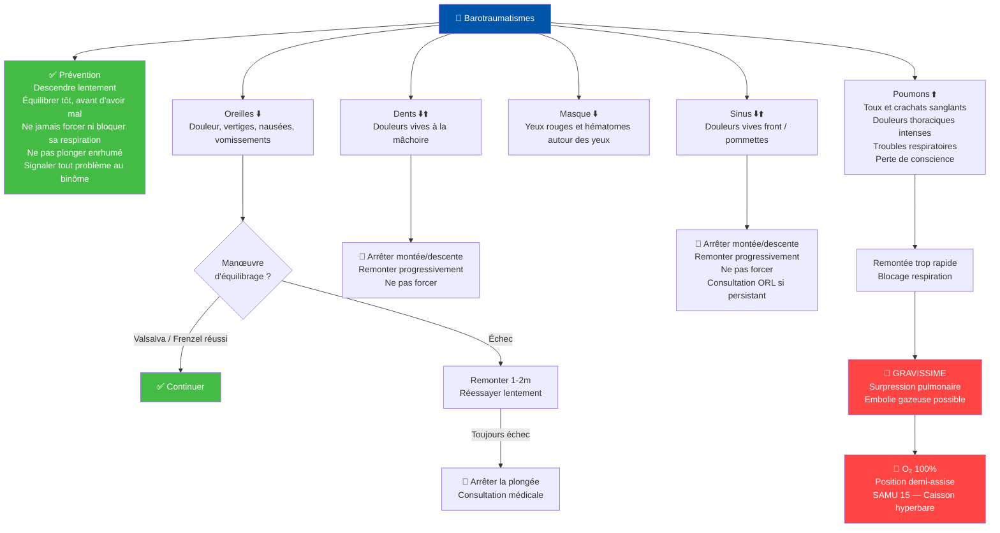
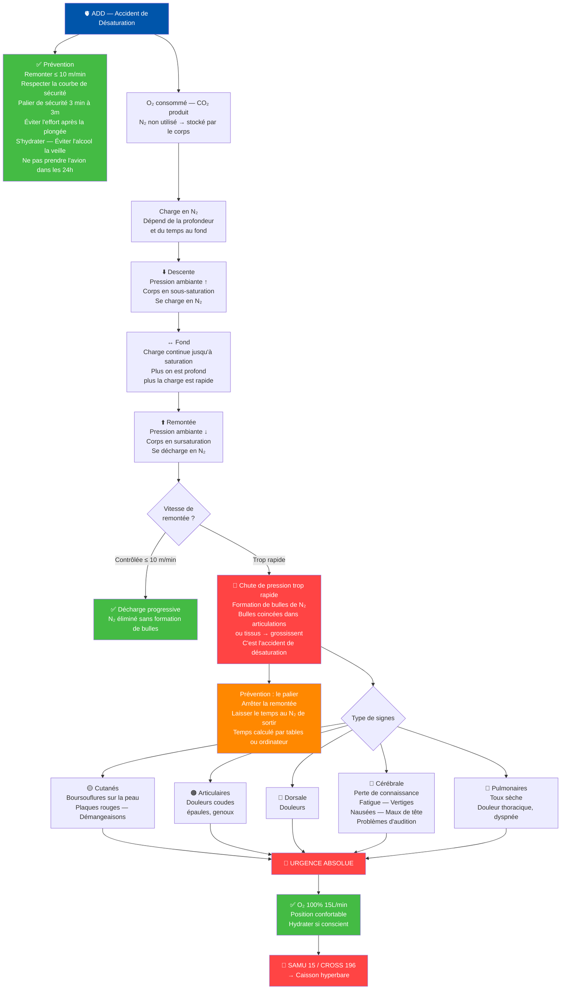
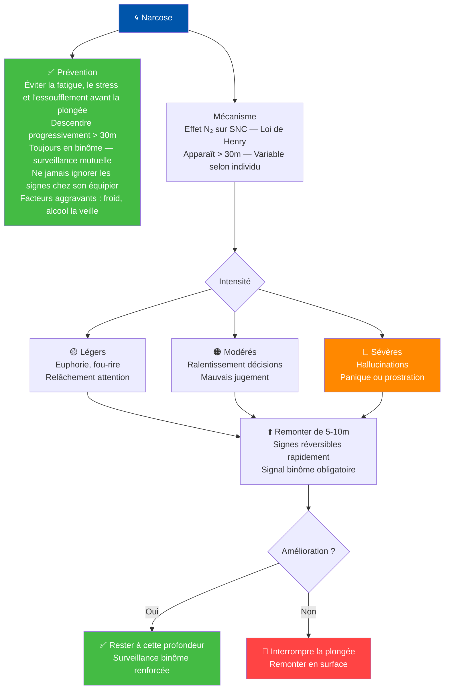
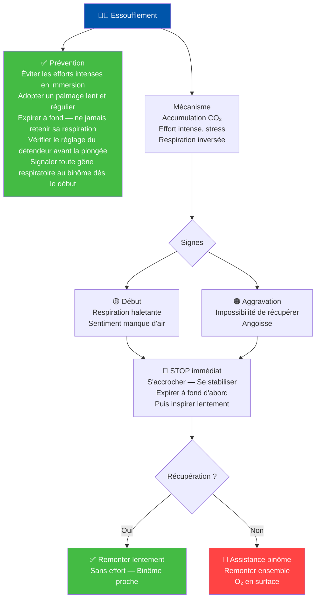
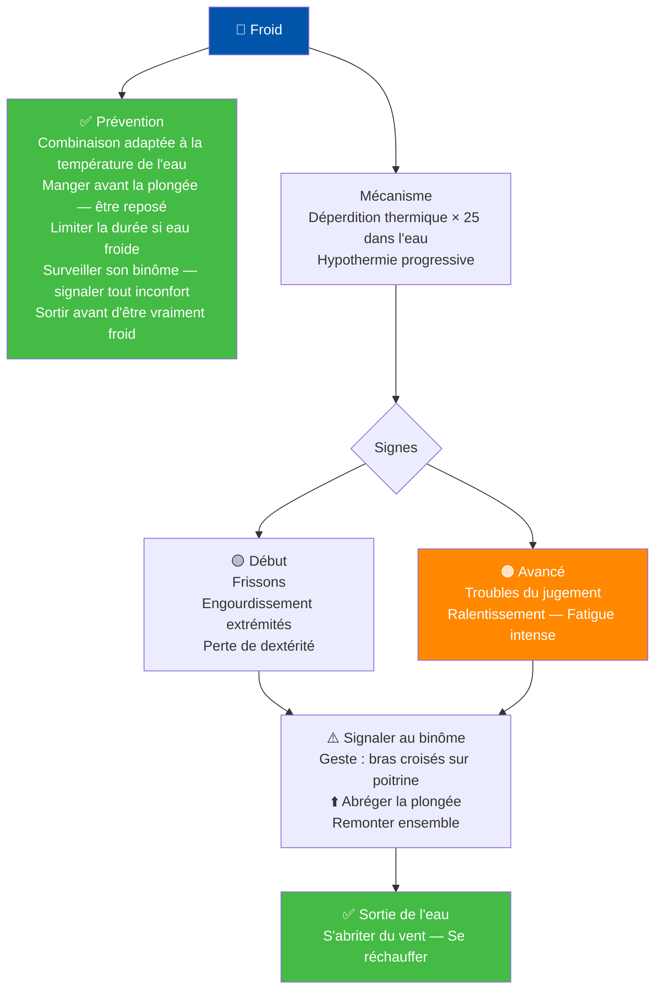
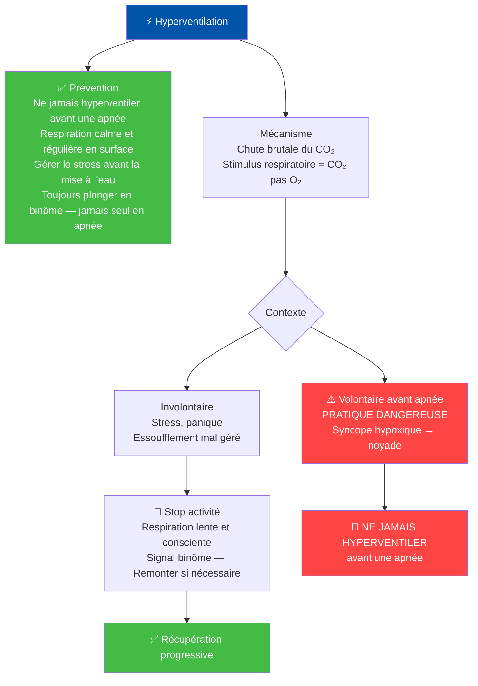

# 🫁 Physiologie & Risques — N2 FFESSM

---

## 🦻 Barotraumatismes

---

## 🫀 ADD — Accident de Désaturation

---

## 🌀 Narcose

---

## 😮‍💨 Essoufflement

---

## 🥶 Froid

---

## ⚡ Hyperventilation

